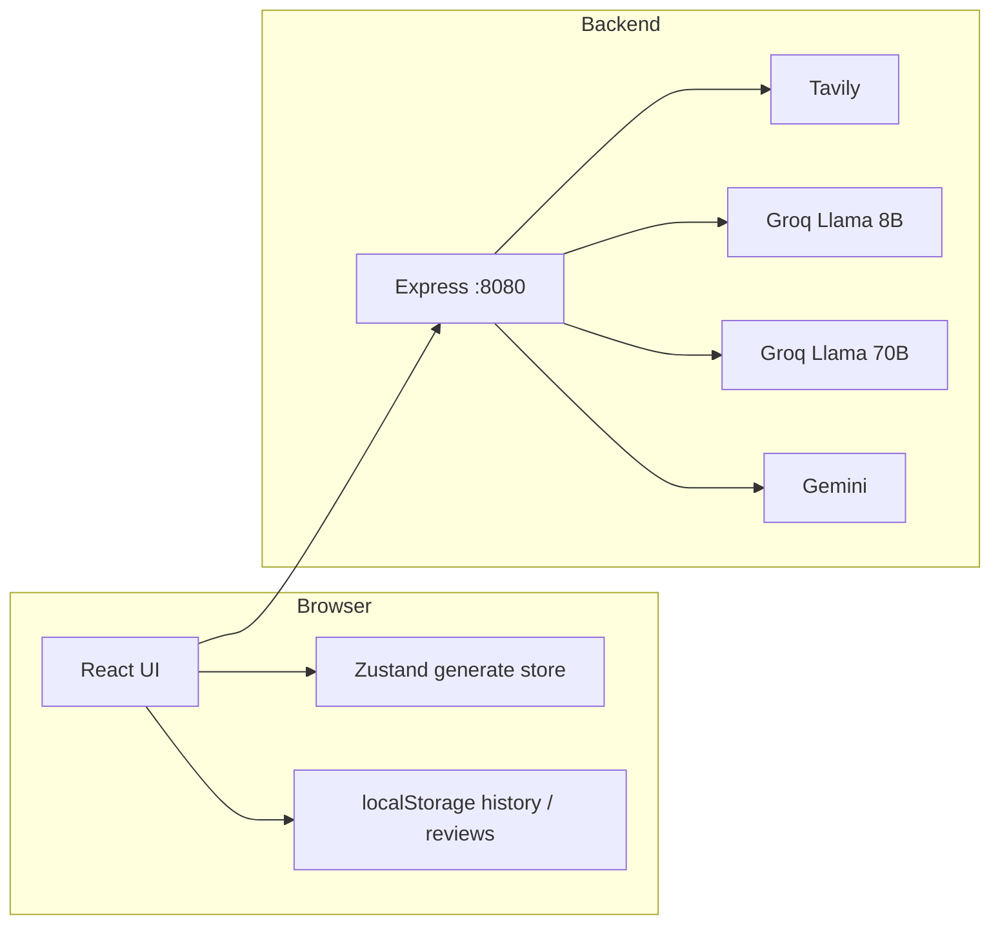

# LabMind AI

**LabMind AI** is a full-stack web application that turns a research hypothesis into a structured, operationally grounded experiment plan. It walks scientists through **hypothesis structuring**, **literature-backed novelty checks**, and **model-generated experiment plans** with materials, budget, timeline, and safety context.

This document is the main reference for **setup**, **configuration**, **architecture**, and **APIs**. Skim the [Table of contents](#table-of-contents) or jump to [Getting started](#getting-started).

---

## Table of contents

- [Overview](#overview)
- [Architecture](#architecture)
- [User experience: stages and routes](#user-experience-stages-and-routes)
- [Tech stack](#tech-stack)
- [Repository structure](#repository-structure)
- [Prerequisites](#prerequisites)
- [Getting started](#getting-started)
  - [Backend](#1-backend)
  - [Frontend](#2-frontend)
  - [Verify](#3-verify)
- [Environment variables](#environment-variables)
- [Running scripts](#running-scripts)
- [HTTP API reference](#http-api-reference)
- [Client-side state and persistence](#client-side-state-and-persistence)
- [Building for production](#building-for-production)
- [Troubleshooting](#troubleshooting)
- [Security notes](#security-notes)
- [License](#license)

---

## Overview

### Problem

Designing a bench-ready experiment from a hypothesis usually requires literature search, protocol thinking, costing, and timeline work. LabMind automates the **grunt work** between idea and bench while keeping outputs **reviewable** (references, verification links, optional mock fallback if models fail).

### Processing pipeline (high level)

| Stage | Route / UI | What happens |
| ----- | ---------- | ------------- |
| **1 — Hypothesis** | `/generate` | Client-side decomposition of the hypothesis (intervention, outcome, mechanism, control). Unlocks literature when step 1 “work” completes. |
| **2 — Literature QC** | Same page | Backend: **Tavily** search → **Llama 8B** validates and shapes novelty + references. |
| **3 — Experiment plan** | Same page | Backend: **Llama 70B** (or **Gemini** fallback) emits a JSON plan → **Tavily** fetches real links per section → **Llama 8B** scores relevance for verification UI. |

Stage 1 uses a lightweight client analyzer; stages 2–3 require the **Node backend** and API keys.

---

## Architecture

Monorepo with a **SPA frontend** (Vite + TanStack) and a **stateless Express API** (Groq/Gemini/Tavily). The browser never stores API keys for model calls; only the backend uses secrets.



- **CORS** is enabled for browser dev origins; tune for production.
- **Literature** queries are length-clipped to satisfy Tavily limits (see `TAVILY_MAX_QUERY_LENGTH` in `backend/src/server.js`).

---

## User experience: stages and routes

### Routes

| Path | Description |
| ---- | ----------- |
| `/` | Marketing home: hero, how it works (`#how`), examples (`#examples`), about (`#about`). Nav links set the hash and scroll. |
| `/generate` | Full pipeline. Search param `h` = hypothesis string; if missing or empty, a **default sample** hypothesis is used. |

### Generate flow details

- **URL sharing:** `https://yoursite/generate?h=Your%20encoded%20hypothesis` loads that text into the run.
- **Session persistence (SPA):** Pipeline progress is held in a **Zustand** store and driven by a **root-level runner** so work continues if you open Home (e.g. About) and return to `/generate` with the **same** `?h=` value.
- **Full restart:** Using **Save** in the hypothesis editor always resets **all three stages** for the saved text (so analysis, literature, and plan match the new wording).
- **Hard refresh:** In-memory state is **lost** on full page reload; `localStorage` only stores **history** and **reviews**, not the in-flight pipeline.

### Default hypothesis

If `h` is absent or blank after trim, the app uses a built-in default cryo/biology example (see `DEFAULT_HYPOTHESIS` in `frontend/src/routes/generate.tsx`).

---

## Tech stack

| Area | Technology |
| ---- | ---------- |
| **UI** | React 19, TypeScript, Vite 7 |
| **Routing / SSR harness** | TanStack Router & TanStack Start (file-based routes) |
| **Styling** | Tailwind CSS 4, Radix-based UI primitives, `tailwind-merge` / `class-variance-authority` |
| **Generate session** | Zustand (`frontend/src/lib/generateStore.ts`) + `GeneratePipelineRunner` in root layout |
| **Validation (client)** | Zod (e.g. `/generate` search params) |
| **Toasts** | Sonner |
| **Backend** | Node.js (ESM), Express 4, `cors`, `dotenv` |
| **Retrieval** | [Tavily](https://tavily.com) API |
| **Models** | [Groq](https://groq.com) (Llama 3.x 8B + 70B), [Google Gemini](https://ai.google.dev) as fallback for plan generation |

---

## Repository structure

```text
lab-mindai/
├── README.md
├── .gitignore
├── frontend/                    # Vite + TanStack Start app
│   ├── package.json
│   ├── vite.config.ts
│   ├── src/
│   │   ├── routes/
│   │   │   ├── __root.tsx      # HTML shell, Toaster, GeneratePipelineRunner
│   │   │   ├── index.tsx       # Home (/, sections #how #examples #about)
│   │   │   └── generate.tsx    # /generate?h=… pipeline UI
│   │   ├── components/
│   │   │   ├── generate/        # Stage1/2/3, PipelineProgress, runner
│   │   │   ├── plan/            # PlanView, materials, timeline, etc.
│   │   │   ├── Navbar.tsx     # section links, theme/sfx
│   │   │   ├── Hero.tsx, HowItWorks.tsx, Footer.tsx
│   │   │   └── ui/              # shadcn-style building blocks
│   │   ├── lib/
│   │   │   ├── generateStore.ts
│   │   │   ├── generateTypes.ts
│   │   │   ├── theme.ts, sfx.ts, storage.ts
│   │   │   ├── fetchModelGeneratedPlan.ts, fetch-plan-sources.ts, plan-generator.ts
│   │   │   └── analyzeHypothesis.ts, planLoadingSteps.ts
│   │   ├── types/               # plan.ts — FullPlan, domains, etc.
│   │   ├── styles.css
│   │   ├── router.tsx
│   │   └── routeTree.gen.ts     # auto-generated; do not edit
│   └── public/ (if any assets)
│
└── backend/
    ├── package.json
    ├── .env.example
    ├── .env                     # you create; gitignored
    └── src/
        └── server.js            # Express: /health, /api/*
```

---

## Prerequisites

- **Node.js** 18 or newer (LTS recommended)
- **npm** (ships with Node)
- **API accounts** (for full functionality): Tavily, Groq, and Google AI (Gemini) — keys go in `backend/.env`

---

## Getting started

### 1. Backend

```bash
cd backend
npm install
cp .env.example .env
# Edit .env — see [Environment variables](#environment-variables)
npm run dev
```

Default listen address: `http://localhost:8080` (override with `PORT` in `.env`).

The backend uses `node --watch` in dev so it restarts on file changes.

### 2. Frontend

```bash
cd ../frontend
npm install
# Optional: see VITE_BACKEND_URL in Environment variables
npm run dev
```

Default Vite dev server: `http://localhost:5173` (Vite may choose another port if 5173 is busy; check the terminal).

### 3. Verify

- Open the printed dev URL in a browser.
- Confirm `GET http://localhost:8080/health` returns `{"ok":true}`.
- On `/generate`, after backend is up, stage 2 should call `POST /api/literature-qc` and stage 3 `POST /api/experiment-plan`.

---

## Environment variables

### Backend (`backend/.env`)

| Variable | Required | Default / notes |
| -------- | -------- | --------------- |
| `PORT` | No | `8080` — HTTP port for Express |
| `TAVILY_API_KEY` | **Yes** (stages 2 & 3 verification) | Tavily bearer token |
| `GROQ_API_KEY` | **Yes** | Groq API key for Llama 8B and 70B |
| `LLAMA8_MODEL` | No | e.g. `llama-3.1-8b-instant` — literature validation & source checks |
| `LLAMA70_MODEL` | No | e.g. `llama-3.3-70b-versatile` — plan JSON generation |
| `GEMINI_API_KEY` | **Recommended** | Used when Groq 70B fails or quota exhausted |
| `GEMINI_MODEL` | No | e.g. `gemini-1.5-flash` — some older ids are remapped in code |

Copy from `backend/.env.example` and fill real values. **Never commit** `.env`.

### Frontend (optional `frontend/.env` or shell)

| Variable | Description |
| -------- | ----------- |
| `VITE_BACKEND_URL` | Base URL of the API (no trailing slash). If unset, client code defaults to `http://localhost:8080`. Set this when the backend is on another host/port in dev or in production. |

Vite only exposes env vars prefixed with `VITE_` to the client. Restart `npm run dev` after changing them.

---

## Running scripts

### Frontend (`frontend/`)

| Command | Purpose |
| ------- | ------- |
| `npm run dev` | Start Vite dev server (HMR) |
| `npm run build` | Production client + SSR/worker bundle (per project Vite config) |
| `npm run build:dev` | Development-mode build |
| `npm run preview` | Serve production build locally |
| `npm run lint` | ESLint |
| `npm run format` | Prettier write entire tree |

### Backend (`backend/`)

| Command | Purpose |
| ------- | ------- |
| `npm run dev` | `node --watch src/server.js` — auto-restart on changes |
| `npm run start` | `node src/server.js` — no watch (containers / prod) |

---

## HTTP API reference

Base URL: `http://localhost:8080` (or your `PORT` / deployed host).

All `POST` bodies are **JSON** (`Content-Type: application/json`). CORS is open by default in dev — **restrict in production**.

### `GET /health`

- **200** — `{ "ok": true }`
- Liveness check for load balancers or scripts.

### `POST /api/literature-qc`

Runs Tavily search, then optional Llama 8B JSON validation of novelty + references.

**Request body**

| Field | Type | Rules |
| ----- | ---- | ----- |
| `hypothesis` | string | Required, **minimum length 6** characters after you send meaningful content (server validates) |

**Success — 200**

JSON including:

- `noveltySignal`: `"not_found" \| "similar_exists" \| "exact_match"`
- `noveltyExplanation`: string
- `references`: array of items with `title`, `authors`, `journal`, `year`, `doi`, `relevance`, `url`, optional `validationStatus`, `confidence`
- `modelFlow`: e.g. `{ retrieval: "tavily", validator: "<model name>", validatorError?: string }`

**Errors**

| Status | Typical cause |
| ------ | --------------- |
| 400 | Missing/short `hypothesis` |
| 500 | Missing `TAVILY_API_KEY` or uncaught error |
| 502 | Tavily HTTP error (details in `details` field) |

### `POST /api/plan-sources`

Parallel Tavily fetches for **verification** links keyed by plan sections (materials, budget, etc.). Used from the client when enriching a plan with `fetchPlanVerificationSources` (e.g. mock fallback path).

**Request body**

| Field | Type | Required |
| ----- | ---- | -------- |
| `hypothesis` | string | **Yes** (min length enforced like above) |
| `experimentTitle` | string | No |
| `domain` | string | No |
| `materials` | array | No — helps targeted search |

**Success — 200**

```json
{ "version": 1, "sources": { /* section → sources */ } }
```

**Errors:** 400 / 500 / similar patterns to other routes.

### `POST /api/experiment-plan`

Generates the full plan JSON (Llama 70B, then Gemini on failure), then attaches **Tavily** verification sources and **Llama 8B** relevance.

**Request body**

| Field | Type | Required |
| ----- | ---- | -------- |
| `hypothesis` | string | **Yes** |
| `priorFeedback` | array | No — optional scientist review snippets from the client to steer the model |

**Success — 200**

```json
{
  "version": 1,
  "modelFlow": {
    "retrievalModel": "source-check:...",
    "planningModel": "llama70:... or gemini:..."
  },
  "plan": { /* FullPlan shape — see frontend/src/types/plan.ts */ }
}
```

**Errors**

| Status | Meaning |
| ------ | -------- |
| 400 | Bad `hypothesis` |
| 502 | Plan model output not JSON, or both Llama 70B and Gemini failed (details in body) |
| 500 | Server error |

---

## Client-side state and persistence

| Mechanism | What it stores | Survives |
| --------- | -------------- | -------- |
| **Zustand** (`generateStore`) | Active stage, work-ready flags, stage outputs, plan pipeline phase | **SPA navigation** only |
| **localStorage** (`lib/storage.ts`) | Recent plan **history** (max 5), per-domain **scientist reviews** | Browser profile, same origin |
| **URL `?h=`** | Canonical hypothesis string for the current run | Shareable, bookmarkable |

`addToHistory` is called when a plan is successfully generated (and in mock paths), not for every intermediate step.

---

## Building for production

```bash
cd frontend
npm run build
```

Output goes to `frontend/dist/` (client + server bundles per your Vite/TanStack config). The repo includes **Cloudflare**-related tooling; deployment steps depend on your host — ensure `VITE_BACKEND_URL` (or your reverse proxy) points the browser to a **public HTTPS** API, and that the API’s CORS policy allows your frontend origin.

Backend:

```bash
cd backend
npm run start
```

Set `PORT` and all secrets in the process environment (not only `.env` on disk) in real deployments.

---

## Troubleshooting

### Port already in use (frontend)

```bash
cd frontend && npm run dev -- --port 5174
```

### Port already in use (backend)

Set `PORT=8081` (or another free port) in `backend/.env` and point the frontend with `VITE_BACKEND_URL=http://localhost:8081`.

### “Missing TAVILY_API_KEY” or 500s on `/api/*`

- Ensure `backend/.env` exists and keys are valid.
- Restart the backend after any `.env` change.
- Check Groq/Gemini dashboards for **rate limits** and **model id** availability.

### Stage 2 or 3 always errors

- Hit `/health` and a simple `POST` to `/api/literature-qc` with `curl` to see raw error bodies.
- Long hypotheses are clipped for Tavily; if Tavily still errors, check their API message in the JSON `details` field (502 from backend).

### Literature or plan returns but looks empty

- Validators may fall back to Tavily-only or weak validation if Llama 8B JSON parsing fails; `modelFlow` in the response often indicates `llama8-unavailable` or an error string.

### Frontend `npm install` issues

```bash
cd frontend
rm -rf node_modules package-lock.json
npm install
```

### CORS in production

The backend uses `cors()` with default broad settings. For production, configure allowed **origins** and methods explicitly in `server.js` or via environment-driven options.

---

## Security notes

- **Secrets** (`TAVILY_API_KEY`, `GROQ_API_KEY`, `GEMINI_API_KEY`) must live **only** on the server. The React app only talks to your API; it does not embed these keys.
- **Do not** commit `backend/.env` or any file containing live keys.
- **Hypothesis text** and generated plans may contain sensitive research ideas; treat logs and error reporting accordingly.

---

## License

Add your preferred license here (for example, MIT).
